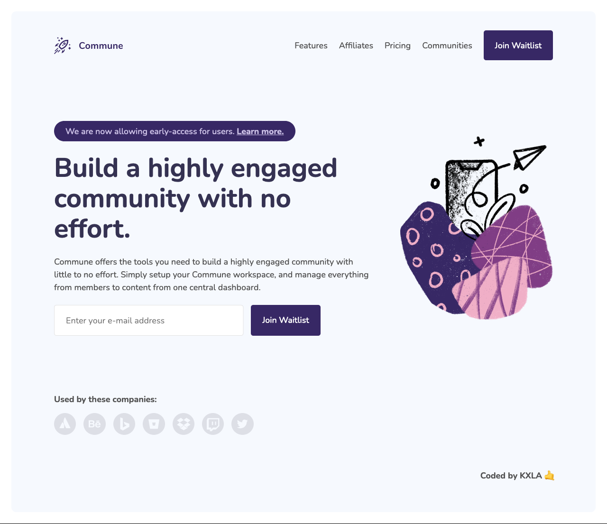
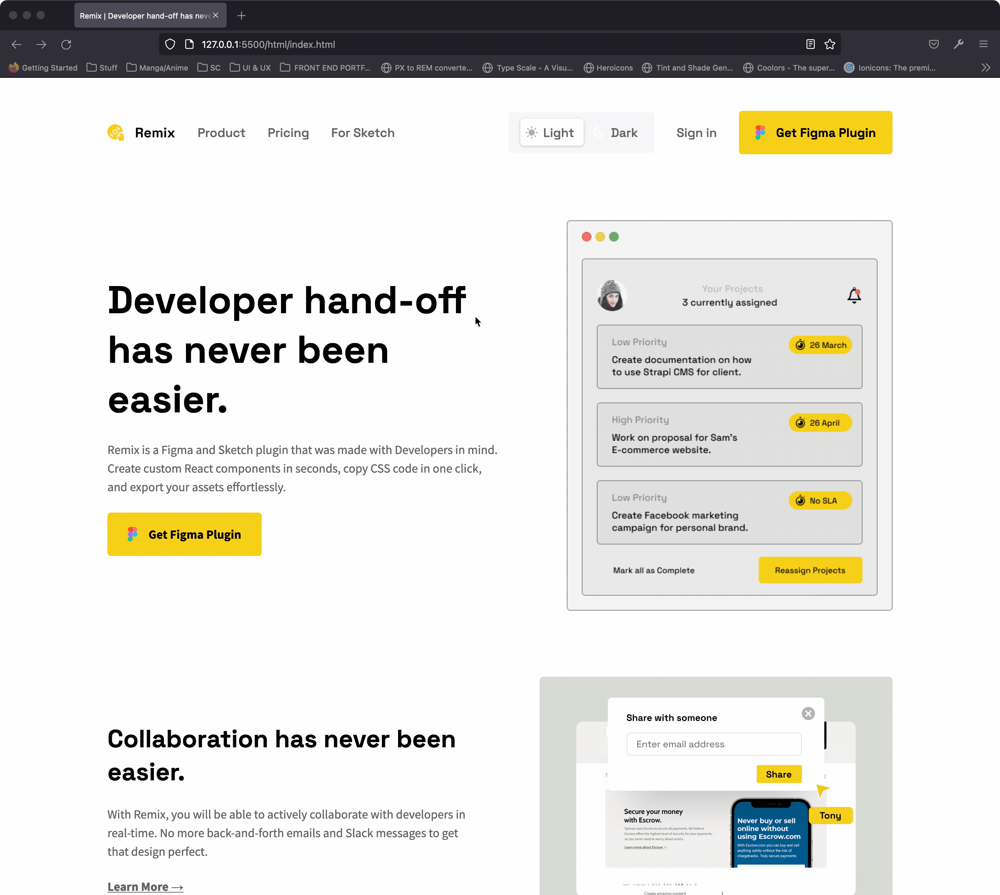

This repository contains links to my submissions to the frontend development challenge projects provided by [Codewell](https://www.codewell.cc/). With [Codewell](https://www.codewell.cc/), you can browse high quality Figma templates that you can use to sharpen your HTML and CSS skills.

## Table of Content
- [Table of Content](#table-of-content)
- [Spense Landing Page](#spense-landing-page)
  - [Demo](#demo)
  - [Details](#details)
  - [Built With](#built-with)
- [Fiber Landing Page](#fiber-landing-page)
  - [Demo](#demo-1)
  - [Details](#details-1)
  - [Built With](#built-with-1)
- [Commune Waitlist Page](#commune-waitlist-page)
  - [Demo](#demo-2)
  - [Details](#details-2)
  - [Built With](#built-with-2)
- [Remix Template](#remix-template)
  - [Demo](#demo-3)
  - [Details](#details-3)
  - [Built With](#built-with-3)
- [IndieBrew Landing Page](#indiebrew-landing-page)
  - [Demo](#demo-4)
  - [Details](#details-4)
  - [Built With](#built-with-4)
- [Unifeed Blog Page](#unifeed-blog-page)
  - [Demo](#demo-5)
  - [Details](#details-5)
  - [Built With](#built-with-5)

## Spense Landing Page
### Demo

### Details
- Challenge : [Spense Landing Page](https://www.codewell.cc/challenges/spense-landing-page--608a7a859691700015db16c5)
- Solution URL: [Github Repo](https://github.com/KXLAA/CW-03-spense)
- Live Site URL: [Live Preview](https://kxlaa.github.io/CW-03-spense/)
  
### Built With
- HTML5
- Vanilla JS
- Flexbox
- SCSS

## Fiber Landing Page
### Demo

### Details
- Challenge : [Fiber Landing Page ](https://www.codewell.cc/challenges/fiber-landing-page--608a7e639691700015db16d1)
- Solution URL: [Github Repo](https://github.com/KXLAA/CW-02-fiber)
- Live Site URL: [Live Preview](https://kxlaa.github.io/CW-02-fiber/)
  
### Built With
- HTML5
- Vanilla JS
- Flexbox
- SCSS

## Commune Waitlist Page
### Demo

### Details
- Challenge : [Commune Waitlist Page](https://www.codewell.cc/challenges/commune-waitlist-page--608d9565747bad001532bd64)
- Solution URL: [Github Repo](https://github.com/KXLAA/CW-01-communie-waitlist)
- Live Site URL: [Live Preview](https://kxlaa.github.io/CW-01-communie-waitlist/)
  
### Built With
- HTML5
- Vanilla JS
- Flexbox
- CSS Grid
- SCSS

## Remix Template
### Demo 

### Details
- Challenge : [Remix Template](https://www.codewell.cc/challenges/remix-template--609f74e13167fa10b79b7b9b)
- Solution URL: [Github Repo](https://github.com/KXLAA/CW-08-Remix)
- Live Site URL: [Live Preview](https://kxlaa.github.io/CW-08-Remix/)
  
### Built With
- HTML5
- Vanilla JS
- Flexbox
- CSS Grid
- SCSS

## IndieBrew Landing Page
### Demo

### Details
- Challenge : [IndieBrew Landing Page](https://www.codewell.cc/challenges/indiebrew-landing-page--608aca51650dff001599e8f9)
- Solution URL: [Github Repo](https://github.com/KXLAA/CW-04-IndieBrew-landing-page.git)
- Live Site URL: [Live Preview](https://kxlaa.github.io/CW-04-IndieBrew-landing-page/)
  
### Built With
- HTML5
- Vanilla JS
- Flexbox
- CSS Grid
- SCSS

## Unifeed Blog Page
### Demo

### Details
- Challenge : [Unifeed Blog Page](https://www.codewell.cc/challenges/unifeed-blog-page--608d9d5c747bad001532bd7c)
- Solution URL: [Github Repo](https://github.com/KXLAA/CW-05-Unifeed-Blog-Page)
- Live Site URL: [Live Preview](https://kxlaa.github.io/CW-05-Unifeed-Blog-Page/)
  
### Built With
- HTML5
- Vanilla JS
- Flexbox
- CSS Grid
- SCSS

<!-- ## TimeNow Landing Page
### Demo

### Details
- Challenge : [TimeNow Landing Page](https://www.codewell.cc/challenges/timenow-landing-page--608d9a7d747bad001532bd70)
- Solution URL: [Github Repo](https://github.com/KXLAA/CW-01-communie-waitlist)
- Live Site URL: [Live Preview](https://kxlaa.github.io/CW-01-communie-waitlist/)
  
### Built With
- HTML5
- Vanilla JS
- Flexbox
- CSS Grid
- SCSS -->

<!-- ## Snipper Landing Page
### Demo

### Details
- Challenge : [Snipper Landing Page](https://www.codewell.cc/challenges/snipper-landing-page--608bbe67e0984a001540d79b)
- Solution URL: [Github Repo](https://github.com/KXLAA/CW-01-communie-waitlist)
- Live Site URL: [Live Preview](https://kxlaa.github.io/CW-01-communie-waitlist/)
  
### Built With
- HTML5
- Vanilla JS
- Flexbox
- CSS Grid
- SCSS -->

